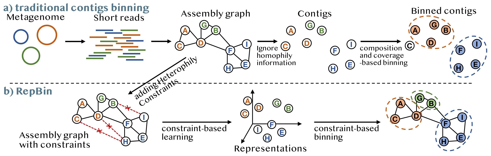
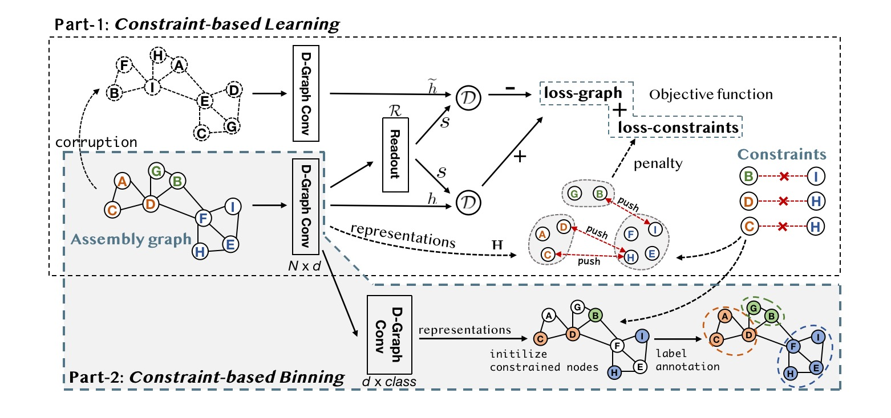
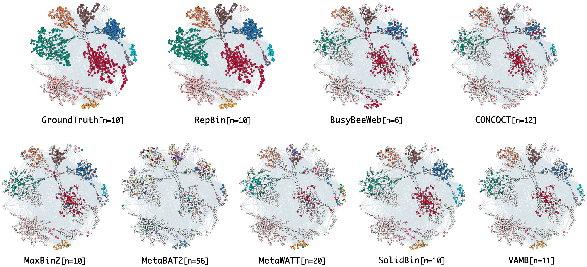

# RepBin
A PyTorch implementation for the [AAAI-2022](https://aaai.org/Conferences/AAAI-22/) paper:<br>
RepBin: Constraint-based Graph Representation Learning for Metagenomic Binning [[ArXiv](xxx)]<br>
[Hansheng Xue](https://xuehansheng.github.io/), [Vijini Mallawaarachchi](https://vijinimallawaarachchi.com/), Yujia Zhang, [Vaibhav Rajan](https://sites.google.com/view/vaibhavrajan/), and [Yu Lin](http://users.cecs.anu.edu.au/~u1024708/)

## Overview
Most metagenomics binning tools ignore the homophily information in assembly graphs and use the composition and coverage information of contigs for binning (refer to Figure 1a for a traditional pipeline for binning). Moreover, these tools have to discard many short contigs and thus suffer from low recall values because the composition and coverage features become unreliable for short contigs. In this paper, we propose a constraint-based graph representation learning model to capture the structural information of the assembly graph while respecting the prior constraints and then bin metagenomic contigs using the learned representations. The proposed model is called ***RepBin*** and is illustrated in Figure 1b.

<p align="center">
  
</p>

The RepBin mainly contains two components, (i) ***Constraint-based Learning***: representation learning on the assembly graph that preserves both homophily relations and heterophily constraints; (ii) ***Constraint-based Binning***: using graph convolutional networks to annotate unknown contigs with labels while using constrained contigs to obtain initial labels.

<p align="center">
  
</p>

To better understand the binning results, we use python-iGraph package to visualize the Sim-10G assembly graph with ground truth and binning results from distinct stand-alone binning tools (see Figure 3). Different colors denote distinct species and grey nodes indicate the nodes that are not identified or are discarded. Black edges represent homophily edges in the assembly graph and grey edges are heterophily constraints. RepBin achieves the most consistent labels with respect to the ground truth while other baselines suffering from missing or incorrect labels.

<p align="center">
  
</p>


## Usage
### Requirement
```
Python 3.6
networkx == 1.11
numpy == 1.18
sklearn == 0.22
pytorch == 1.3.1
```
### Reproducibility
To reproduce the experiments on Sim-5G dataset, simply run:
```python
python3 main.py --dataset Sim-5G --n_clusters 5 --patience 20
```

## Citation
All readers are welcome to star/fork this repository and use it to reproduce our experiments or train your own data. Please kindly cite our paper:
```bibtex
@inproceedings{Xue2022RepBin,
  title     = {RepBin: Constraint-based Graph Representation Learning for Metagenomic Binning},
  author    = {Xue, Hansheng and Mallawaarachchi, Vijini and Zhang, Yujia and Rajan, Vaibhav and Lin, Yu},
  booktitle = {AAAI},
  year      = {2022}
}
```